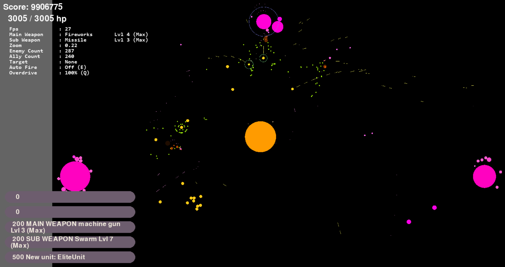

# 🛡️ 2D Real-Time Action Game

An exciting 2D action survival game built in **Python** with **Pygame**.  
Battle waves of spawning enemies, upgrade your weapons, build your military base, and dominate the battlefield!

---

## 📋 Table of Contents

- [About the Project](#-about-the-project)
- [Features](#-features)
- [Snapshots](#-snapshots)
- [Installation](#-installation)
- [How to Play](#-how-to-play)
- [Winning Strategies](#-winning-strategies)
- [Future Plans](#-future-plans)

---

## 🧩 About the Project

This project is a modular, highly extensible 2D action-survival game demonstrating complex AI behavior, dynamic weapon systems, real-time physics interactions, and vibrant particle effects.  
Build your army, evolve your firepower, and survive the onslaught!

---

## 🚀 Features

### 🕹️ Core Gameplay
- **Player-controlled Units**: Move, aim, shoot, spawn units.
- **Dynamic Weapon System**:
  - Main & Sub weapons.
  - Upgradable and evolvable weapons.
- **Spawning and Upgrades**:
  - Spawn allied units to fight alongside you.
  - Unlock stronger hulls and new weapon technologies.
- **Balanced Score System**:
  - Earn score by defeating enemies.
  - Spend score to spawn allies.
  - _"To spawn one, you must kill one."_

### 🤖 AI and Enemies
- **Smart Enemy AI**: 
  - Targets players intelligently.
  - Predicts player movement and adjusts aim.
  - Retreats when critically damaged.
- **Homing Missiles**: Seek and intercept moving targets.
- **Explosive Deaths**: All units explode into debris upon destruction.

### 🧠 Physics and Collision
- **Accurate Collision Detection**.
- **Laser Mechanics** with dynamic, shrinkable length.
- **Repel Forces** to prevent unit stacking.
- **Optimized Spatial Partitioning** for scalable performance.

### ✨ Visual Effects
- **Explosions, Shields, and Fading Particles** for a lively battlefield.
- **Color and Size** dynamically adjust based on unit health and speed.

---

## 🖼️ Snapshots



*(Tip: Create an `assets/screenshots/` folder and place your gameplay images or GIFs inside.)*

---

## 📦 Installation

1. Clone the repository:
   ```bash
   git clone https://github.com/stanX19/ShootingGame.git ShootingGame
   cd ShootingGame
   ```

2. Install dependencies:
   ```bash
   py -m pip install -r requirements.txt
   ```

3. Run the game:
   ```bash
   python srcs/main.py
   ```

---

## 🎮 How to Play

| Action           | Key / Mouse         |
|:-----------------|:--------------------|
| Move             | `WASD` keys         |
| Aim              | Mouse Cursor        |
| Fire Main Weapon | Left Click          |
| Fire Sub Weapon  | Right Click         |
| Upgrades         | Bottom-left Buttons |

Defeat enemies, upgrade your equipment, or expand your army!

---

## 🧠 Winning Strategies

You can clear the game using **two different strategies**:
- **Strength Strategy**: 
  - Focus on upgrading your main unit.
  - Become an unstoppable powerhouse with high DPS and resilience.
- **Army Strategy**: 
  - Spawn multiple allied units using your score.
  - Overwhelm the enemies through sheer numbers and teamwork.

Choose your playstyle — conquer through **personal power** or **military might**!

---

## 🛤️ Future Plans

- New enemy types and epic bosses
- More diverse and specialized weapon classes
- Sound Effects and Background Music
- Better compulsion loop

---
